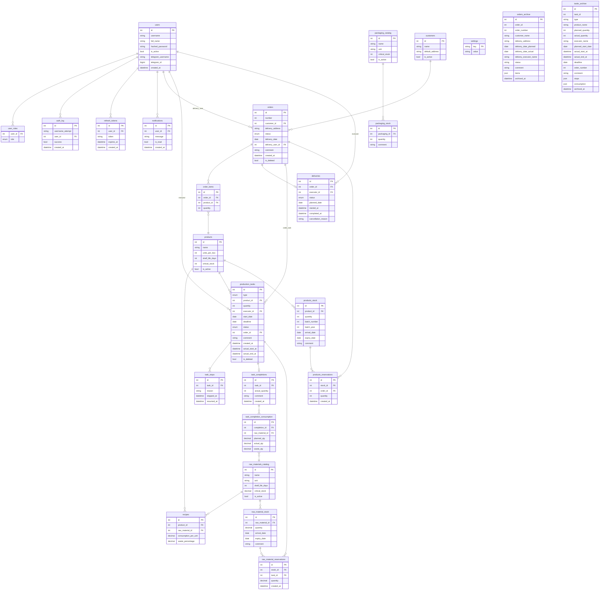

# ERD — АИС «Ярко»

```mermaid
erDiagram
    users {
        int id PK
        string username
        string full_name
        string hashed_password
        bool is_active
        string telegram_username
        bigint telegram_id
        datetime created_at
    }
    user_roles {
        int user_id FK
        enum role
    }
    auth_log {
        int id PK
        string username_attempt
        int user_id FK
        bool success
        datetime created_at
    }
    refresh_tokens {
        int id PK
        int user_id FK
        string token
        datetime expires_at
        datetime created_at
    }
    customers {
        int id PK
        string name
        string default_address
        bool is_active
    }
    products {
        int id PK
        string name
        int units_per_box
        int shelf_life_days
        int critical_stock
        bool is_active
    }
    raw_materials_catalog {
        int id PK
        string name
        string unit
        int shelf_life_days
        decimal critical_stock
        bool is_active
    }
    packaging_catalog {
        int id PK
        string name
        string unit
        int critical_stock
        bool is_active
    }
    recipes {
        int id PK
        int product_id FK
        int raw_material_id FK
        decimal consumption_per_unit
        decimal waste_percentage
    }
    orders {
        int id PK
        int number
        int customer_id FK
        string delivery_address
        enum status
        date delivery_date
        int delivery_user_id FK
        string comment
        datetime created_at
        bool is_deleted
    }
    order_items {
        int id PK
        int order_id FK
        int product_id FK
        int quantity
    }
    production_tasks {
        int id PK
        enum type
        int product_id FK
        int quantity
        int executor_id FK
        date start_date
        date deadline
        enum status
        int order_id FK
        string comment
        datetime created_at
        datetime actual_start_at
        datetime actual_end_at
        bool is_deleted
    }
    task_stops {
        int id PK
        int task_id FK
        string reason
        datetime stopped_at
        datetime resumed_at
    }
    task_completions {
        int id PK
        int task_id FK
        int actual_quantity
        string comment
        datetime created_at
    }
    task_completion_consumption {
        int id PK
        int completion_id FK
        int raw_material_id FK
        decimal planned_qty
        decimal actual_qty
        decimal waste_qty
    }
    raw_material_stock {
        int id PK
        int raw_material_id FK
        decimal quantity
        date arrival_date
        date expiry_date
        string comment
    }
    packaging_stock {
        int id PK
        int packaging_id FK
        int quantity
        string comment
    }
    products_stock {
        int id PK
        int product_id FK
        int quantity
        int batch_number
        int batch_year
        date arrival_date
        date expiry_date
        string comment
    }
    raw_material_reservations {
        int id PK
        int stock_id FK
        int task_id FK
        decimal quantity
        datetime created_at
    }
    products_reservations {
        int id PK
        int stock_id FK
        int order_id FK
        int quantity
        datetime created_at
    }
    deliveries {
        int id PK
        int order_id FK
        int executor_id FK
        enum status
        date planned_date
        datetime started_at
        datetime completed_at
        string cancellation_reason
    }
    notifications {
        int id PK
        int user_id FK
        string message
        bool is_read
        datetime created_at
    }
    settings {
        string key PK
        string value
    }
    orders_archive {
        int id PK
        int order_id
        int order_number
        string customer_name
        string delivery_address
        date delivery_date_planned
        date delivery_date_actual
        string delivery_executor_name
        string status
        string comment
        json items
        datetime archived_at
    }
    tasks_archive {
        int id PK
        int task_id
        string type
        string product_name
        int planned_quantity
        int actual_quantity
        string executor_name
        date planned_start_date
        datetime actual_start_at
        datetime actual_end_at
        date deadline
        int order_number
        string comment
        json stops
        json consumption
        datetime archived_at
    }

    %% Пользователи
    users ||--o{ user_roles : ""
    users ||--o{ auth_log : ""
    users ||--o{ refresh_tokens : ""
    users ||--o{ notifications : ""
    users ||--o{ orders : "delivery_user"
    users ||--o{ production_tasks : "executor"
    users ||--o{ deliveries : "executor"

    %% Справочники
    products ||--o{ recipes : ""
    raw_materials_catalog ||--o{ recipes : ""

    %% Заказы
    customers ||--o{ orders : ""
    orders ||--o{ order_items : ""
    order_items }o--|| products : ""
    orders ||--o| deliveries : ""
    orders ||--o{ production_tasks : "order_task"
    orders ||--o{ products_reservations : ""

    %% Производство
    products ||--o{ production_tasks : ""
    production_tasks ||--o{ task_stops : ""
    production_tasks ||--o| task_completions : ""
    task_completions ||--o{ task_completion_consumption : ""
    task_completion_consumption }o--|| raw_materials_catalog : ""
    production_tasks ||--o{ raw_material_reservations : ""

    %% Склад
    raw_materials_catalog ||--o{ raw_material_stock : ""
    packaging_catalog ||--o{ packaging_stock : ""
    products ||--o{ products_stock : ""
    raw_material_stock ||--o{ raw_material_reservations : ""
    products_stock ||--o{ products_reservations : ""
```
